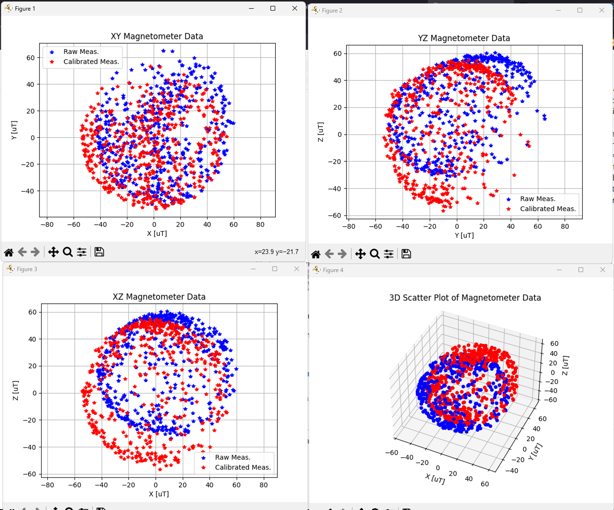
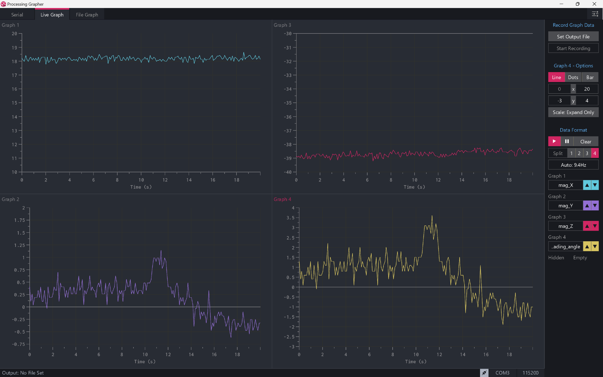

# Calibrating 3-Axis Magnetometers

# Quy Trình Hiệu Chỉnh
## Bước 1: Xuất Dữ Liệu Ngăn Cách Bằng Dấu Phẩy Ra Cổng Serial(Comma-Separated)

Bước đầu tiên là đọc dữ liệu từ cảm biến từ kế của bạn và xuất dữ liệu đó ra kết nối serial với máy tính của bạn. Tôi đã sử dụng Arduino Uno + GU271(HMC5883L) (link: https://handsontec.com/dataspecs/sensor/GY-271%20HMC5883L.pdf) với thư viện của Korneliusz Jarzębski (link: https://github.com/jarzebski/Arduino-HMC5883L). Sketch arduio ở trong thư mục setup\GY271_calibration. Dữ liệu từ cổng serial ở dạng "15 , 20 , 10"

## Bước 2: Xác Định Cường Độ Từ Trường Địa Phương

Magneto yêu cầu độ lớn của từ trường trái đất tại vị trí hiệu chuẩn. [NOAA's World Magnetic Model 2020](https://www.ngdc.noaa.gov/geomag/WMM/calculators.shtml). Chỉ cần nhập vĩ độ, kinh độ và độ cao của bạn trên mực nước biển trung bình, và ghi lại tham số Total Field (Tổng Trường) đơn vị Microtesla  [uT]. 

## Bước 3: Ghi Dữ Liệu Vào Tệp Văn Bản Ngăn Cách Bằng Tab
Sử dụng log-mag-readings.py để đọc dữ liệu serial. Kết quả các thông số hiệu chuẩn ở terminal. Cần thay đổi tên tệp, SAMPLE_FREQ và thời gian đọc T_SAMPLE, từ trường thực tế F0 .

Khi mã bắt đầu chạy, hãy xoay cảm biến của bạn theo các hướng khác nhau để đảm bảo đo được từ trường trái đất ở nhiều hướng cảm biến.

# Kết quả

## Resources
* [Original](https://github.com/michaelwro/mag-cal-example)
* [World Magnetic Model 2020 Calculator](https://www.ngdc.noaa.gov/geomag/WMM/calculators.shtml)
* [Paramagnetism - Wikipedia](https://en.wikipedia.org/wiki/Paramagnetism)
* [Magnetometer - Wikipedia](https://en.wikipedia.org/wiki/Magnetometer)
* [Magnetometer Errors and Calibration - teslabs](https://teslabs.com/articles/magnetometer-calibration/)
